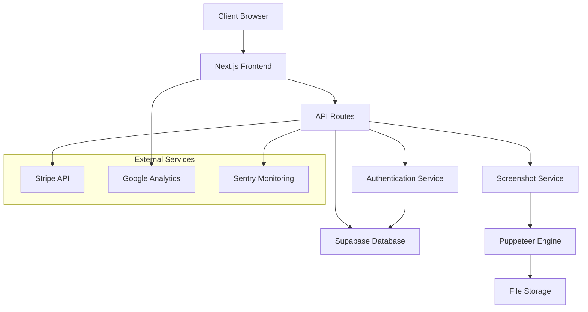

# SnapWeb Complete Implementation Design

## Overview

SnapWeb is a Next.js-based web application that provides website screenshot generation with a freemium business model. The architecture emphasizes performance, security, and scalability while maintaining a professional, enterprise-quality user experience. The design follows strict minimalist principles with no gradients, emojis, or excessive animations, ensuring fast loading times and responsive layouts optimized for both desktop and mobile experiences. The system integrates Supabase for data persistence, Stripe for payments, and Puppeteer for screenshot generation.

## Architecture

### System Architecture



### Technology Stack

- **Frontend**: Next.js 13+ with App Router, Tailwind CSS, React
- **Backend**: Next.js API Routes, Serverless Functions
- **Database**: Supabase (PostgreSQL with real-time features)
- **Authentication**: NextAuth.js with Supabase integration
- **Payments**: Stripe Checkout and Billing Portal
- **Screenshot Engine**: Puppeteer with headless Chrome
- **File Storage**: Vercel Blob or Supabase Storage
- **Monitoring**: Sentry for errors, Google Analytics for usage
- **Deployment**: Vercel with automatic CI/CD

## Design System and Visual Guidelines

### Visual Design Principles
- **Professional Minimalism**: Clean, uncluttered interfaces with plenty of white space
- **Enterprise Quality**: Business-appropriate design suitable for professional environments
- **No Visual Noise**: Elimination of gradients, emojis, excessive shadows, and distracting animations
- **Fast Loading**: Optimized for performance with minimal CSS and efficient rendering
- **Accessibility First**: High contrast ratios, clear typography, and keyboard navigation support

### Typography System
- **Primary Font**: Inter or system fonts for optimal performance and readability
- **Heading Hierarchy**: Clear size progression (32px, 24px, 20px, 18px, 16px)
- **Body Text**: 16px base size with 1.5 line height for optimal readability
- **Color Contrast**: Minimum 4.5:1 ratio for all text elements
- **Font Weights**: Regular (400), Medium (500), Semibold (600) only

### Color Palette
- **Primary**: #2563eb (Blue 600) - for primary actions and links
- **Secondary**: #64748b (Slate 500) - for secondary text and elements
- **Success**: #059669 (Emerald 600) - for success states
- **Warning**: #d97706 (Amber 600) - for warning states
- **Error**: #dc2626 (Red 600) - for error states
- **Background**: #ffffff (White) and #f8fafc (Slate 50)
- **Text**: #0f172a (Slate 900) and #475569 (Slate 600)
- **Borders**: #e2e8f0 (Slate 200) and #cbd5e1 (Slate 300)

### Spacing System
- **Base Unit**: 4px (0.25rem)
- **Common Spacing**: 8px, 12px, 16px, 24px, 32px, 48px, 64px
- **Component Padding**: 12px (small), 16px (medium), 24px (large)
- **Section Margins**: 48px (mobile), 64px (tablet), 96px (desktop)

### Component Specifications
- **Buttons**: 40px height (mobile), 44px height (desktop), 12px border radius
- **Input Fields**: 44px height, 8px border radius, 1px border
- **Cards**: 12px border radius, 1px border, subtle shadow only when necessary
- **Icons**: 20px (small), 24px (medium), 32px (large) - SVG only, no emojis

### Responsive Breakpoints
- **Mobile**: 320px - 767px (custom mobile-first design)
- **Tablet**: 768px - 1023px (optimized tablet layout)
- **Desktop**: 1024px+ (full desktop experience with proper spacing)
- **Large Desktop**: 1440px+ (max-width container with centered content)

### Logo and Branding
- **Logo**: Custom SVG logo combining camera/screen icon with "SnapWeb" typography
- **Logo Variations**: Horizontal (header), vertical (footer), icon-only (favicon)
- **Tagline**: "Professional Website Screenshots"
- **Favicon**: Custom icon representing screenshot/camera concept
- **Brand Colors**: Consistent use of primary blue with neutral grays
- **Logo Usage**: Consistent placement and sizing across all pages and components

### Icon System
- **Icon Library**: Heroicons or Lucide React for consistent professional icons
- **Icon Sizes**: 16px, 20px, 24px, 32px based on context
- **Icon Style**: Outline style for consistency and clarity
- **Icon Usage**: Meaningful icons that enhance usability (camera, download, settings, user, etc.)
- **No Decorative Icons**: Icons serve functional purposes only

## Components and Interfaces

### Frontend Components

#### Core Layout Components
- **Header**: Clean navigation with text-based logo, clear button labels, and professional menu structure optimized for both desktop and mobile
- **Footer**: Minimal footer with essential legal links and company information
- **Layout**: Consistent page wrapper with proper responsive breakpoints and SEO meta tags

#### Feature Components
- **ScreenshotForm**: Clean, professional interface with clear labels, proper spacing, intuitive controls, and helpful icons
- **PricingCards**: Simple, readable pricing display with clear feature comparison, check icons for features, and professional styling
- **Dashboard**: Professional dashboard with clear data visualization, usage charts, proper typography, and logical information hierarchy
- **ScreenshotGallery**: Clean grid layout with proper image handling, thumbnail previews, clear action buttons with icons
- **BlogCard**: Minimal article preview with readable typography, clear visual hierarchy, and relevant icons
- **APIDocumentation**: Clean, well-structured API reference with proper code formatting, copy buttons, and navigation icons
- **AuthPages**: Professional login/signup forms with clear validation, proper spacing, and security icons
- **SettingsPages**: Organized settings with clear sections, toggle switches, and descriptive icons
- **BillingPages**: Clean billing interface with invoice history, payment methods, and financial icons

#### UI Components
- **Button**: Professional button styling with clear text labels, proper contrast ratios, and consistent sizing across desktop/mobile
- **Input**: Clean form inputs with proper validation states, clear labels, and accessible error messaging
- **Modal**: Simple overlay dialogs with clear content hierarchy and proper focus management
- **Toast**: Minimal notification system with clear messaging and appropriate timing
- **LoadingSpinner**: Simple, professional loading indicators without distracting animations

#### Design System Principles
- **No Emojis**: All icons use professional SVG icons or text labels
- **No Gradients**: Solid colors only with proper contrast ratios
- **Minimal Animations**: Only essential transitions for user feedback (hover states, loading indicators)
- **Professional Typography**: Clear, readable fonts with proper hierarchy
- **Responsive Design**: Custom layouts for desktop, tablet, and mobile (not stretched mobile designs)
- **Fast Loading**: Optimized assets and minimal CSS for quick page loads
- **Enterprise Quality**: Professional appearance suitable for business use
- **Consistent Spacing**: Uniform spacing system across all components and pages
- **Clear Visual Hierarchy**: Proper use of typography, spacing, and color to guide user attention

## Page-Specific Design Requirements

### Homepage Design
- **Hero Section**: Clean headline, subheading, and prominent CTA button with screenshot preview
- **Features Section**: Grid layout with icons, clear descriptions, and benefits
- **How It Works**: Step-by-step process with numbered icons and clear explanations
- **Pricing Preview**: Simplified pricing cards with clear value propositions
- **Social Proof**: Customer testimonials or usage statistics (if available)
- **Footer**: Comprehensive footer with organized links and company information

### Dashboard Design
- **Overview Cards**: Usage statistics, remaining credits, recent activity with clear icons
- **Quick Actions**: Prominent screenshot generation form and recent screenshots
- **Navigation Sidebar**: Clear menu with icons and active states
- **Data Visualization**: Simple charts for usage trends (no complex animations)
- **Account Status**: Clear indication of plan type and billing status

### Screenshot Gallery Design
- **Grid Layout**: Responsive grid with consistent thumbnail sizes
- **Filter/Sort Options**: Clear dropdown menus and search functionality
- **Image Preview**: Modal or expanded view with download and share options
- **Bulk Actions**: Select multiple screenshots with clear action buttons
- **Pagination**: Simple pagination with page numbers and navigation

### Pricing Page Design
- **Comparison Table**: Clear feature comparison with check/cross icons
- **Plan Cards**: Detailed pricing cards with clear CTAs and feature lists
- **FAQ Section**: Expandable questions with clear answers
- **Billing Options**: Monthly/yearly toggle with savings indication

### API Documentation Design
- **Navigation Sidebar**: Organized API endpoints with clear categorization
- **Code Examples**: Syntax-highlighted code blocks with copy buttons
- **Interactive Testing**: API playground with input forms and response display
- **Authentication Guide**: Clear setup instructions with visual examples

### Authentication Pages Design
- **Login/Signup Forms**: Clean forms with proper validation and error states
- **Social Login**: Professional social login buttons with brand colors
- **Password Reset**: Clear flow with helpful instructions and feedback
- **Email Verification**: Simple confirmation pages with clear next steps

### Settings Pages Design
- **Profile Settings**: Clean form layout with avatar upload and account details
- **Billing Settings**: Payment methods, invoices, and subscription management
- **API Settings**: API key generation and usage monitoring
- **Preferences**: Toggle switches and dropdown menus for user preferences

### Legal Pages Design
- **Privacy Policy**: Well-structured content with clear headings and readable typography
- **Terms of Service**: Organized sections with proper legal formatting
- **About Page**: Company information with professional layout and team information

### API Endpoints

#### Public Endpoints
- `POST /api/screenshot` - Generate screenshot (rate limited)
- `GET /api/health` - System health check
- `POST /api/contact` - Contact form submission

#### Authenticated Endpoints
- `GET /api/user/profile` - User account information
- `GET /api/user/screenshots` - User's screenshot history
- `DELETE /api/user/screenshots/[id]` - Delete screenshot
- `POST /api/user/api-key` - Generate/regenerate API key
- `GET /api/user/usage` - Usage statistics and billing info

#### Payment Endpoints
- `POST /api/stripe/create-checkout` - Create Stripe checkout session
- `POST /api/stripe/create-portal` - Create billing portal session
- `POST /api/stripe/webhook` - Handle Stripe webhooks

#### Admin Endpoints
- `GET /api/admin/stats` - System-wide statistics
- `GET /api/admin/users` - User management (paginated)
- `POST /api/admin/cleanup` - Manual cleanup of expired screenshots

## Data Models

### User Model
```typescript
interface User {
  id: string;
  email: string;
  name: string;
  avatar_url?: string;
  plan: 'free' | 'pro' | 'team';
  credits: number;
  total_screenshots: number;
  api_key?: string;
  stripe_customer_id?: string;
  subscription_id?: string;
  subscription_status?: string;
  subscription_end_date?: Date;
  preferences: {
    defaultFormat: 'png' | 'jpeg' | 'webp';
    defaultResolution: string;
    emailNotifications: boolean;
  };
  created_at: Date;
  updated_at: Date;
}
```

### Screenshot Model
```typescript
interface Screenshot {
  id: string;
  user_id?: string;
  url: string;
  filename: string;
  original_url: string;
  metadata: {
    width: number;
    height: number;
    fileSize: number;
    format: string;
    captureTime: number;
    deviceType: string;
  };
  settings: {
    format: string;
    quality?: number;
    fullPage: boolean;
    device: string;
  };
  status: 'pending' | 'completed' | 'failed';
  error_message?: string;
  downloads: number;
  is_public: boolean;
  expires_at: Date;
  created_at: Date;
}
```

### Payment Model
```typescript
interface Payment {
  id: string;
  user_id: string;
  type: 'subscription' | 'credits';
  provider: 'stripe';
  provider_id: string;
  amount: number;
  currency: string;
  status: 'pending' | 'completed' | 'failed' | 'refunded';
  description: string;
  processed_at?: Date;
  created_at: Date;
}
```

## Error Handling

### Client-Side Error Handling
- Form validation with real-time feedback
- Network error recovery with retry mechanisms
- Graceful degradation for JavaScript-disabled browsers
- User-friendly error messages with actionable guidance

### Server-Side Error Handling
- Structured error responses with consistent format
- Rate limiting with clear error messages and retry headers
- Input validation and sanitization at API boundaries
- Comprehensive logging with correlation IDs

### Screenshot Generation Error Handling
- Timeout handling for slow-loading websites
- Invalid URL detection and user feedback
- Resource limit handling (memory, CPU)
- Fallback mechanisms for failed captures

## Testing Strategy

### Unit Testing
- Component testing with React Testing Library
- API endpoint testing with Jest and Supertest
- Utility function testing with comprehensive coverage
- Database model validation testing

### Integration Testing
- End-to-end user flows with Playwright
- Payment flow testing with Stripe test mode
- Screenshot generation testing with sample URLs
- Authentication flow testing

### Performance Testing
- Lighthouse CI integration for Core Web Vitals
- Load testing for screenshot generation endpoints
- Database query performance monitoring
- Bundle size analysis and optimization

### Security Testing
- SSRF vulnerability testing for URL inputs
- Authentication and authorization testing
- Rate limiting effectiveness testing
- Input sanitization validation

## SEO and Content Strategy

### Technical SEO
- Server-side rendering for all public pages
- Automatic sitemap generation with dynamic content
- Structured data markup for software application
- Canonical URLs and proper meta tags
- Open Graph and Twitter Card integration

### Content Architecture
- Blog system with markdown support and syntax highlighting
- API documentation with interactive examples
- Help center with searchable articles
- Case studies and user testimonials

### Performance Optimization
- Image optimization with Next.js Image component
- Code splitting and lazy loading for all pages
- CDN integration through Vercel
- Critical CSS inlining and font optimization
- Minimal CSS bundle with no unnecessary animations or effects
- Optimized responsive breakpoints for fast rendering
- Efficient component rendering with proper React optimization
- Fast-loading professional fonts with proper fallbacks
- Lighthouse score targets: Performance >90, Accessibility >95, Best Practices >90, SEO >90
- Core Web Vitals optimization for all pages
- Lazy loading for images and non-critical components
- Efficient bundle splitting and tree shaking

### Quality Assurance Requirements
- **Cross-browser Testing**: Chrome, Firefox, Safari, Edge compatibility
- **Device Testing**: Desktop (1920x1080, 1366x768), Tablet (768x1024), Mobile (375x667, 414x896)
- **Accessibility Compliance**: WCAG 2.1 AA standards with proper ARIA labels
- **Performance Testing**: Page load times under 3 seconds on 3G networks
- **Visual Regression Testing**: Consistent appearance across all supported devices
- **Error Handling**: Graceful error states with helpful user messaging
- **Loading States**: Proper loading indicators for all async operations
- **Form Validation**: Real-time validation with clear error messages

## Security Considerations

### Input Validation
- URL sanitization to prevent SSRF attacks
- File upload validation and virus scanning
- SQL injection prevention through parameterized queries
- XSS prevention through proper output encoding

### Authentication Security
- Secure session management with httpOnly cookies
- Password hashing with bcrypt
- Rate limiting on authentication endpoints
- Account lockout after failed attempts

### API Security
- API key authentication for programmatic access
- Request signing for sensitive operations
- CORS configuration for browser security
- Rate limiting per user and IP address

### Data Protection
- Encryption at rest for sensitive data
- HTTPS enforcement across all endpoints
- Regular security audits and dependency updates
- GDPR compliance with data retention policies

## Deployment and Infrastructure

### Vercel Configuration
- Automatic deployments from Git branches
- Environment variable management
- Edge function deployment for global performance
- Preview deployments for testing

### Database Management
- Supabase hosted PostgreSQL with automatic backups
- Row-level security policies for data isolation
- Connection pooling for performance
- Migration management with version control

### Monitoring and Observability
- Sentry integration for error tracking
- Google Analytics for user behavior analysis
- Custom metrics for business KPIs
- Uptime monitoring with alerting

### Scaling Considerations
- Horizontal scaling through serverless functions
- Database read replicas for performance
- CDN caching for static assets
- Queue system for background processing