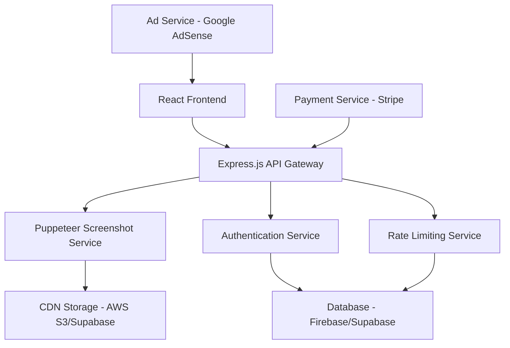

# Design Document

## Overview

SnapWeb is a sophisticated yet intuitive web application that transforms URL-to-screenshot generation into a premium user experience. The design philosophy centers on creating a unique, professional interface that stands apart from existing tools through custom visual elements, smooth interactions, and intelligent user guidance.

The application follows a single-page architecture with progressive enhancement, ensuring core functionality works across all devices while providing enhanced experiences on modern browsers. The design emphasizes clarity, speed, and visual appeal without sacrificing functionality.

## Architecture

### System Architecture



### Frontend Architecture

- **Framework**: React 18 with TypeScript for type safety and developer experience
- **Styling**: TailwindCSS with custom design system extensions
- **State Management**: Zustand for lightweight, performant state management
- **HTTP Client**: Axios with interceptors for error handling and loading states
- **Build Tool**: Vite for fast development and optimized production builds

### Backend Architecture

- **Runtime**: Node.js with Express.js framework
- **Screenshot Engine**: Puppeteer running in containerized environment
- **Queue System**: BullMQ with Redis for handling concurrent screenshot requests
- **File Storage**: AWS S3 or Supabase Storage with CDN distribution
- **Database**: Supabase for user management, API keys, and usage tracking

## Components and Interfaces

### Core Frontend Components

#### 1. Header Component
- Logo with custom SVG design
- Navigation menu (API Access, Docs, Login)
- Responsive hamburger menu for mobile
- Subtle gradient background with glassmorphism effect

#### 2. URL Input Component
- Large, prominent input field with custom styling
- Real-time URL validation with visual feedback
- Paste detection with automatic URL extraction
- Placeholder text with rotating example URLs

#### 3. Resolution Selector Component
- Custom dropdown with device preview icons
- Preset options: Desktop (1920x1080), Tablet (768x1024), Mobile (375x667)
- Custom resolution input with validation
- Visual device mockups showing selected resolution

#### 4. Capture Controls Component
- Primary action button with loading states and micro-animations
- Full-page toggle with explanatory tooltip
- Advanced options panel (collapsible)
- Progress indicator with estimated time remaining###
# 5. Screenshot Preview Component
- Responsive image container with zoom functionality
- Download options with format selection (PNG, JPEG, WebP)
- Share link generation with copy-to-clipboard
- Metadata display (dimensions, file size, capture time)

#### 6. Loading States Component
- Animated progress bar with smooth transitions
- Status messages with contextual information
- Skeleton screens for content areas
- Error boundary with retry functionality

#### 7. Advertisement Integration Component
- Non-intrusive ad placements with native styling
- Lazy loading to prevent performance impact
- Premium user detection for ad hiding
- Fallback content for ad-blocked environments

### Backend API Interfaces

#### Screenshot Generation Endpoint
```typescript
POST /api/screenshot
Content-Type: application/json

interface ScreenshotRequest {
  url: string;
  width?: number;
  height?: number;
  fullPage?: boolean;
  format?: 'png' | 'jpeg' | 'webp';
  quality?: number; // 1-100 for JPEG
  deviceScaleFactor?: number;
  timeout?: number;
}

interface ScreenshotResponse {
  success: boolean;
  imageUrl: string;
  metadata: {
    width: number;
    height: number;
    fileSize: number;
    format: string;
    captureTime: number;
  };
  error?: string;
}
```

#### API Authentication Endpoint
```typescript
POST /api/auth/validate
Authorization: Bearer <api_key>

interface AuthResponse {
  valid: boolean;
  userId: string;
  plan: 'free' | 'basic' | 'pro' | 'enterprise';
  usage: {
    current: number;
    limit: number;
    resetDate: string;
  };
}
```

## Data Models

### User Model
```typescript
interface User {
  id: string;
  email: string;
  createdAt: Date;
  subscription: {
    plan: 'free' | 'basic' | 'pro' | 'enterprise';
    status: 'active' | 'cancelled' | 'expired';
    currentPeriodEnd: Date;
  };
  apiKey: string;
  usage: {
    screenshots: number;
    lastReset: Date;
  };
  preferences: {
    defaultResolution: string;
    defaultFormat: string;
    fullPageDefault: boolean;
  };
}
```

### Screenshot Model
```typescript
interface Screenshot {
  id: string;
  userId?: string; // null for anonymous users
  url: string;
  imageUrl: string;
  metadata: {
    width: number;
    height: number;
    fileSize: number;
    format: string;
    fullPage: boolean;
    captureTime: number;
  };
  createdAt: Date;
  expiresAt: Date;
  accessCount: number;
}
```

### API Usage Model
```typescript
interface ApiUsage {
  id: string;
  userId: string;
  endpoint: string;
  timestamp: Date;
  responseTime: number;
  success: boolean;
  errorCode?: string;
  metadata: Record<string, any>;
}
```

## Visual Design System

### Color Palette
```css
:root {
  /* Primary Colors */
  --primary-50: #eff6ff;
  --primary-100: #dbeafe;
  --primary-500: #3b82f6;
  --primary-600: #2563eb;
  --primary-700: #1d4ed8;
  
  /* Neutral Colors */
  --neutral-50: #f8fafc;
  --neutral-100: #f1f5f9;
  --neutral-200: #e2e8f0;
  --neutral-500: #64748b;
  --neutral-700: #334155;
  --neutral-900: #0f172a;
  
  /* Semantic Colors */
  --success-500: #10b981;
  --warning-500: #f59e0b;
  --error-500: #ef4444;
  
  /* Gradients */
  --gradient-primary: linear-gradient(135deg, #667eea 0%, #764ba2 100%);
  --gradient-subtle: linear-gradient(135deg, #f5f7fa 0%, #c3cfe2 100%);
}
```

### Typography Scale
```css
.text-display {
  font-size: 3.75rem; /* 60px */
  line-height: 1.1;
  font-weight: 800;
}

.text-h1 {
  font-size: 2.25rem; /* 36px */
  line-height: 1.2;
  font-weight: 700;
}

.text-h2 {
  font-size: 1.875rem; /* 30px */
  line-height: 1.3;
  font-weight: 600;
}

.text-body-lg {
  font-size: 1.125rem; /* 18px */
  line-height: 1.6;
  font-weight: 400;
}

.text-body {
  font-size: 1rem; /* 16px */
  line-height: 1.5;
  font-weight: 400;
}

.text-caption {
  font-size: 0.875rem; /* 14px */
  line-height: 1.4;
  font-weight: 500;
}
```

### Spacing System (8px Grid)
```css
:root {
  --space-1: 0.25rem; /* 4px */
  --space-2: 0.5rem;  /* 8px */
  --space-3: 0.75rem; /* 12px */
  --space-4: 1rem;    /* 16px */
  --space-6: 1.5rem;  /* 24px */
  --space-8: 2rem;    /* 32px */
  --space-12: 3rem;   /* 48px */
  --space-16: 4rem;   /* 64px */
  --space-20: 5rem;   /* 80px */
}
```

### Animation System
```css
:root {
  --duration-fast: 150ms;
  --duration-normal: 250ms;
  --duration-slow: 350ms;
  
  --easing-ease-out: cubic-bezier(0.0, 0.0, 0.2, 1);
  --easing-ease-in: cubic-bezier(0.4, 0.0, 1, 1);
  --easing-ease-in-out: cubic-bezier(0.4, 0.0, 0.2, 1);
}

.transition-smooth {
  transition: all var(--duration-normal) var(--easing-ease-out);
}

.animate-fade-in {
  animation: fadeIn var(--duration-normal) var(--easing-ease-out);
}

@keyframes fadeIn {
  from { opacity: 0; transform: translateY(8px); }
  to { opacity: 1; transform: translateY(0); }
}
```## 
User Interface Layout

### Desktop Layout (1200px+)
```
┌─────────────────────────────────────────────────────────────┐
│ Header: Logo | Navigation | Login                           │
├─────────────────────────────────────────────────────────────┤
│                                                             │
│  ┌─────────────────────────────────────────────────────┐    │
│  │              URL Input Field                        │    │
│  │  [Enter website URL...]                    [Paste] │    │
│  └─────────────────────────────────────────────────────┘    │
│                                                             │
│  ┌──────────────┐  ┌──────────────┐  ┌─────────────────┐   │
│  │ Resolution   │  │ Format       │  │ [Generate]      │   │
│  │ Desktop ▼    │  │ PNG ▼        │  │                 │   │
│  └──────────────┘  └──────────────┘  └─────────────────┘   │
│                                                             │
│  ┌─────────────────────────────────────────────────────┐    │
│  │                                                     │    │
│  │           Screenshot Preview Area                   │    │
│  │                                                     │    │
│  │  [Download PNG] [Download JPEG] [Copy Link]        │    │
│  └─────────────────────────────────────────────────────┘    │
│                                                             │
│ [Ad Space]                                    [Ad Space]    │
└─────────────────────────────────────────────────────────────┘
```

### Mobile Layout (320px-768px)
```
┌─────────────────────────────┐
│ ☰ Logo           Login      │
├─────────────────────────────┤
│                             │
│ ┌─────────────────────────┐ │
│ │ Enter website URL...    │ │
│ └─────────────────────────┘ │
│                             │
│ ┌─────────────────────────┐ │
│ │ Resolution: Mobile ▼    │ │
│ └─────────────────────────┘ │
│                             │
│ ┌─────────────────────────┐ │
│ │    Generate Screenshot  │ │
│ └─────────────────────────┘ │
│                             │
│ ┌─────────────────────────┐ │
│ │                         │ │
│ │   Screenshot Preview    │ │
│ │                         │ │
│ └─────────────────────────┘ │
│                             │
│ [Download] [Share]          │
│                             │
│ [Ad Banner]                 │
└─────────────────────────────┘
```

## Custom Design Elements

### Unique Visual Components

#### 1. Floating Action Button
- Custom-designed primary button with subtle 3D effect
- Hover state with gentle lift animation
- Loading state with spinning icon and progress ring
- Success state with checkmark animation

#### 2. Device Preview Cards
- Custom SVG illustrations for each device type
- Hover animations showing screen content preview
- Active state with glowing border effect
- Smooth transitions between selections

#### 3. Screenshot Gallery Grid
- Masonry layout for optimal space utilization
- Lazy loading with intersection observer
- Hover overlays with action buttons
- Smooth zoom animations on click

#### 4. Progress Visualization
- Custom animated progress bar with gradient fill
- Step-by-step process indicators
- Estimated time remaining with smart calculations
- Error states with retry animations

### Micro-Interactions

#### Input Field Interactions
```css
.url-input {
  transition: all 250ms cubic-bezier(0.4, 0.0, 0.2, 1);
}

.url-input:focus {
  transform: scale(1.02);
  box-shadow: 0 0 0 3px rgba(59, 130, 246, 0.1);
}

.url-input.valid {
  border-color: var(--success-500);
  background-image: url('data:image/svg+xml;base64,PHN2Zy...');
}
```

#### Button Hover Effects
```css
.primary-button {
  position: relative;
  overflow: hidden;
}

.primary-button::before {
  content: '';
  position: absolute;
  top: 0;
  left: -100%;
  width: 100%;
  height: 100%;
  background: linear-gradient(90deg, transparent, rgba(255,255,255,0.2), transparent);
  transition: left 600ms;
}

.primary-button:hover::before {
  left: 100%;
}
```

## Error Handling

### Error State Design

#### 1. Input Validation Errors
- Inline error messages with red accent color
- Icon indicators for different error types
- Helpful suggestions for common mistakes
- Auto-correction for minor URL formatting issues

#### 2. Network and Server Errors
- Full-screen error states with illustration
- Clear explanation of what went wrong
- Actionable retry buttons with different strategies
- Fallback options when primary service fails

#### 3. Screenshot Generation Errors
- Contextual error messages in preview area
- Specific error codes with user-friendly explanations
- Alternative suggestions (different resolution, retry)
- Support contact information for persistent issues

### Error Recovery Patterns

```typescript
interface ErrorState {
  type: 'validation' | 'network' | 'server' | 'timeout';
  message: string;
  suggestion: string;
  retryable: boolean;
  retryCount: number;
  maxRetries: number;
}

const errorRecovery = {
  validation: () => showInlineError(),
  network: () => showRetryWithBackoff(),
  server: () => showFallbackOptions(),
  timeout: () => showProgressiveRetry()
};
```

## Testing Strategy

### Frontend Testing Approach

#### 1. Unit Testing (Jest + React Testing Library)
- Component rendering and prop handling
- User interaction simulation
- State management logic
- Utility function validation
- Custom hook behavior

#### 2. Integration Testing
- API integration with mock responses
- Form submission workflows
- Error handling scenarios
- Authentication flows
- Payment processing integration

#### 3. Visual Regression Testing (Chromatic/Percy)
- Component visual consistency
- Responsive design validation
- Cross-browser rendering
- Dark/light theme variations
- Animation and transition testing

#### 4. End-to-End Testing (Playwright)
- Complete user workflows
- Screenshot generation process
- Payment and subscription flows
- Mobile device testing
- Performance benchmarking

### Backend Testing Strategy

#### 1. API Testing
- Endpoint functionality validation
- Request/response schema validation
- Authentication and authorization
- Rate limiting behavior
- Error response consistency

#### 2. Screenshot Service Testing
- Puppeteer integration testing
- Different website compatibility
- Performance under load
- Memory leak detection
- Timeout handling

#### 3. Load Testing
- Concurrent request handling
- Database performance under load
- CDN integration testing
- Auto-scaling validation
- Resource utilization monitoring

### Performance Testing

#### 1. Frontend Performance
- Core Web Vitals monitoring (LCP, FID, CLS)
- Bundle size optimization
- Image loading performance
- Animation frame rate testing
- Memory usage profiling

#### 2. Backend Performance
- API response time benchmarking
- Screenshot generation speed
- Database query optimization
- CDN cache hit rates
- Server resource utilization

### Accessibility Testing

#### 1. Automated Testing (axe-core)
- WCAG 2.1 AA compliance validation
- Color contrast verification
- Keyboard navigation testing
- Screen reader compatibility
- Focus management validation

#### 2. Manual Testing
- Screen reader testing (NVDA, JAWS, VoiceOver)
- Keyboard-only navigation
- High contrast mode compatibility
- Zoom level testing (up to 200%)
- Motor impairment simulation

This comprehensive design document provides the foundation for building a unique, professional, and highly functional screenshot generation tool that meets all the specified requirements while delivering an exceptional user experience.